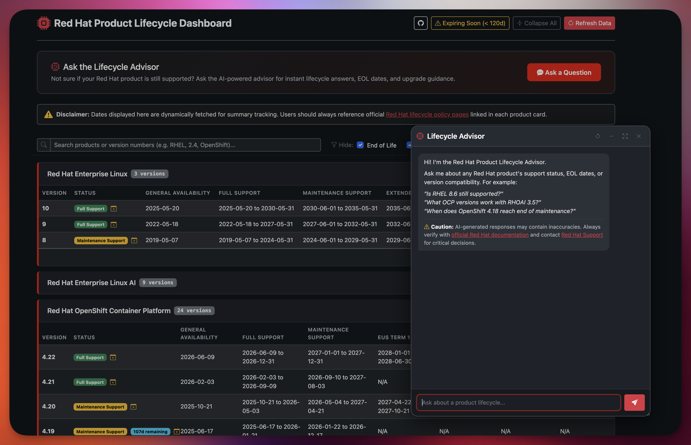

# 🚀 Red Hat Product Lifecycle Dashboard

An interactive, live dashboard that aggregates and tracks end-of-life (EOL), support phase transitions, and active update windows across Red Hat products. Built with FastAPI and vanilla JavaScript, it consumes the official Red Hat Product Life Cycles API to give system administrators, platform engineers, and enterprise architects a unified view of their infrastructure's support status. Powered with AI-powered Lifecycle Advisor to answer any questions you have about lifecycle.

🌐 **Live Demo:** [https://rhlifecycle.kubernetes.day](https://rhlifecycle.kubernetes.day)



<!-- Core Stack -->


---

## 🌟 Features

- ⚡ **Real-Time API Data** — Pulls support lifecycle phases directly from Red Hat's public API endpoints.
- 🏷️ **Dynamic Status Resolution** — Evaluates live phase windows (Full Support, EUS, Maintenance, EOM, EOL) against today's date to compute accurate status badges.
- 🤖 **AI-Powered Lifecycle Advisor** — An integrated chatbot that answers product lifecycle questions, powered by Azure OpenAI & Groq. Supports tool-calling to look up live data from the Red Hat API.
- 📅 **.ics Calendar Export** — Download calendar events for active product versions with built-in alert triggers at **120, 90, 60, and 30 days** before expiry. Compatible with Outlook, Google Calendar, and Apple Calendar.
- ⏳ **EOL Urgency Counters** — Visual badges flag versions nearing support expiration within 120 days.
- 🔍 **Quick Filter & Search** — Search by product name, major/minor version, and filter out End of Life or End of Maintenance entries.
- 📱 **Responsive UI** — Mobile-friendly card layout with sticky search bar, built on Bootstrap 5 in a dark enterprise theme.

---

## 🏗️ Architecture

```text
Browser ──► GET / ──► FastAPI (Jinja2) ──► index.html
         ──► GET /api/data ──► Fan-out async httpx ──► Red Hat Lifecycle API
         ──► POST /api/chat ──► Azure OpenAI / Groq ──► Tool calls ──► Red Hat Lifecycle API
```

**Single-file backend** (`app.py`) — Product config, async API fetching, date parsing, chat endpoint with LLM tool-calling loop, and route handlers.

**Single-file frontend** (`templates/index.html`) — Jinja2-served HTML with inline JS/CSS. No build step, no bundler.

**AI Chat** — The Lifecycle Advisor uses Azure OpenAI gpt-4 as the primary backend with Groq gpt-oss-120b as fallback. It supports a 12-iteration tool-calling loop to look up live lifecycle data before generating responses. Rate limit retries are handled automatically.

---

## 🛠️ Tech Stack

| Layer | Technology |
| :--- | :--- |
| Backend | Python 3.12+, FastAPI, httpx, Jinja2 |
| Frontend | Vanilla JS (ES6+), Bootstrap 5, Bootstrap Icons |
| AI / LLM | Azure OpenAI (primary), Groq (fallback) |
| Data Source | [Red Hat Product Life Cycles API](https://access.redhat.com/product-life-cycles/api/v1/products) |
| Hosting | [Render](https://render.com/) |
| DNS & Security | [Cloudflare](https://www.cloudflare.com/) (Proxied DNS, SSL/TLS Full Strict, Workers for failover) |
| Monitoring | UptimeRobot / Cron-Job.org via `/health` endpoint |

---

## 🐳 Quickstart

Pre-built container images are published automatically on every push to `main`:

- **Quay:** `quay.io/jgoh/rhlifecyclesummary:latest`
- **GHCR:** `ghcr.io/explicitworkload/rhlifecyclesummary:latest`

### 📦 Run from a pre-built image

```bash
podman run -d -p 8881:8881 --env-file .env --name rh-dashboard quay.io/jgoh/rhlifecyclesummary:latest
```

### 🐳 Run with Podman/Docker Compose

```bash
git clone https://github.com/explicitworkload/rhlifecyclesummary.git
cd rhlifecyclesummary

# Production
podman-compose up -d

# Development (mounts local files for hot-reload)
podman-compose -f podman-compose.yaml -f podman-compose.override.yaml up -d
```

### ⚡ Run with Tilt

```bash
tilt up
```

### 💻 Run locally (no container)

```bash
pip install fastapi uvicorn jinja2 httpx requests
uvicorn app:app --host 0.0.0.0 --port 8881 --reload
```

### 🔐 Environment Variables

Copy `.env.sample` to `.env` and fill in the values. The dashboard works without AI credentials — the Lifecycle Advisor will simply be disabled.

| Variable | Required | Description |
| :--- | :--- | :--- |
| `GROQ_API_KEY` | No | Groq API key (fallback LLM) |
| `GROQ_MODEL` | No | Model name for Groq endpoint |
| `GROQ_API_URL` | No | Groq-compatible API URL |
| `AZURE_TENANT_ID` | No | Azure AD tenant ID |
| `AZURE_CLIENT_ID` | No | Azure AD app client ID |
| `AZURE_CLIENT_SECRET` | No | Azure AD app client secret |
| `AZURE_OPENAI_ENDPOINT` | No | Azure OpenAI endpoint URL |
| `AZURE_OPENAI_DEPLOYMENT` | No | Azure OpenAI deployment name |

---

## 📡 API Endpoints

| Endpoint | Methods | Description |
| :--- | :--- | :--- |
| `/` | `GET`, `HEAD` | Main dashboard UI |
| `/api/data` | `GET` | Aggregated JSON feed from Red Hat API |
| `/api/chat` | `POST` | Lifecycle Advisor chat endpoint |
| `/health` | `GET`, `HEAD` | Health check — returns `{"status": "ok"}` |
| `/robots.txt` | `GET` | Web crawler rules |

---

## 📁 Repository Structure

```text
rh-lifecycle-summary/
├── .github/workflows/
│   ├── release-latest.yml          # Build & push :latest to GHCR on main
│   └── release.yml                 # Tagged release build
├── templates/
│   └── index.html                  # Jinja2 dashboard UI (inline JS/CSS)
├── app.py                          # FastAPI backend & API logic
├── azure_token_refresh.py          # Azure OAuth2 client credentials token manager
├── Dockerfile                      # Container build
├── podman-compose.yaml             # Production compose config
├── podman-compose.override.yaml    # Dev overrides (volume mount, .env)
├── Tiltfile                        # Tilt local dev orchestration
├── .env.sample                     # Environment variable template
└── README.md
```

---

## ⚠️ Disclaimer

Dates displayed on this dashboard are dynamically fetched for summary tracking. The AI-powered Lifecycle Advisor may produce inaccurate responses. Always reference official [Red Hat lifecycle policy pages](https://access.redhat.com/product-life-cycles/update_policies) linked in each product card and contact [Red Hat Support](https://access.redhat.com/support) for critical decisions.

---

## 👤 Maintainer

Maintained by **John** — [me@kubernetes.day](mailto:me@kubernetes.day)

Distributed under the MIT License. Contributions, bug reports, and feature requests are welcome!
